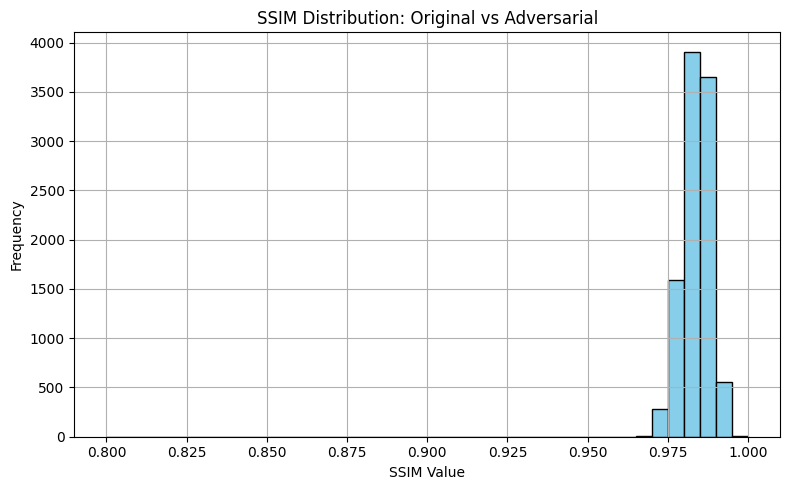
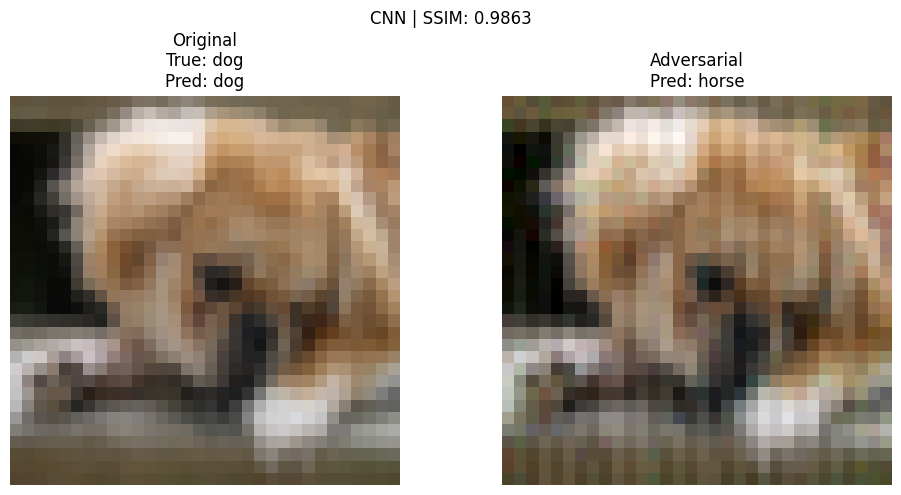

# 敵対的摂動による分類モデルの転移可能な脆弱性評価
## 概要
本リポジトリでは，画像分類タスクに対する**敵対的摂動（Adversarial Perturbation）の生成**と，その**転移可能性**に関する検証を行う．  
敵対的生成とは，分類や回帰といった機械学習モデルの出力を**意図的に誤らせる入力改変**であり，セキュリティやAIに関する信頼性の観点から，近年大きな注目を集めている.特に本リポジトリでは入力画像に対して**人間の認知では気づきにくい微小な変化**を加えることで，モデルの予測を誤らせる攻撃手法について検討を行う．   

敵対的摂動の多くは， **攻撃対象モデルの構造や勾配情報を前提とした"ホワイトボックス攻撃"を想定しているが，異なる構造のモデル間でも攻撃が有効に作用する"転移可能性"** の存在が知られている．これはモデルの構造を知りえない攻撃者にとって極めて都合の良い性質であり，**モデル構造非依存のセキュリティ上の深刻なリスク**とみなされている．

このような問題意識のもと，本リポジトリでは以下の点に焦点をあて，検証・考察を行う：
- 敵対的摂動の代表手法の実装と比較
- 異なる構造の分類モデル間での**攻撃転移性の定量的検証**
- 敵対的摂動の**局所領域制限（Local UAP）による現実的攻撃ケースの再現
- 攻撃手法の想定ユースケースに関する検討
- **攻撃の転移性が生じる要因についての理論的考察**
- **小規模モデルを用いた大規模モデルへの強力な転移攻撃**の実現可能性に関する考察


敵対事例の生成方法としては大別して以下の3つのアプローチを試みた: 
- FGSM  
    モデルの損失関数に対する勾配に沿って，1ステップで摂動を生成するシンプルかつ高速な攻撃手法．
- UAP  
    訓練データ全体に共通して適用できる汎用的な摂動ベクトル（行列）を学習し，タスクレベルでの誤分類を誘発する.
- 局所的UAP（Local UAP）  
    画像の一部領域（例：左上の8x8領域など）のみにUAPに基づく改変をすることで，現実世界における「ステッカー攻撃」などに対応．

※ 各攻撃方法の理論的詳細や想定ユースケースについては[こちら](Appendix_Attack.md)を参照．  
※ なお，本リポジトリでは**CIFAR-10**をデータに対する多クラス分類タスクを用いて検証を行った．

## モデル及びデータの構成
本リポジトリでは，CIFAR-10データセットに対する分類タスクを対称に以下の3種類の異なる画像分類モデルを使用した．各モデルに対して攻撃を加えるとともに，**転移性の定量評価**を行った
### 使用データセット（CIFAR-10）
- CIFAR-10
    - サイズ：32x32のRGB画像（チャネル数 = 3）
    - クラス数：10（airplane, automobile, bird, cat, deer, dog, frog, horse, ship, truck）
    - 学習用画像：50,000枚 / テスト画像：10,000枚

### モデル構成一覧
| モデル名        | 概要                                   | 主な用途（本リポジトリ内）        |
| ----------- | ------------------------------------ | -------------------- |
| `CNN_small` | 訓練データの内，10,000枚の画像を用いた小規模データのモデル   | 軽量な敵対摂動の訓練・転移元モデル    |
| `CNN`       | 訓練データをすべて使用したCNNモデル             | 汎用的な敵対摂動の訓練元・評価対象モデル |
| `ResNet18`  | torchvision実装のResNet構造．残差接続による深層分類器． | 高精度モデルとしての評価対象（転移先）  |

## ディレクトリ構成
本リポジトリの主要なディレクトリは以下の通り構成．
``` bash
├── attacks/ # 生成済みの敵対サンプル（FGSM, UAP, Local UAPなど）を格納  
│ ├── fgsm/  
│ ├── uap/  
│ └── local_uap/  
│ └── genelate_....ipynb #各種敵対生成コード
├── models/ # 学習済みモデル（CNN, ResNetなど）の保存先  
├── data/ # CIFAR-10などの元データ保存先  
├── utils/ # 攻撃・評価・可視化の補助関数群（*.py）  
├── notebooks/ # 評価・可視化・解析用のJupyter Notebook  
│ ├── eval_uap.ipynb  
│ ├── eval_local_uap.ipynb  
│ └── eval_fgsm.ipynb  
│── results/  
│ └── figs/ # 実験結果の図・SSIM分布・画像比較結果など
└── data_download.ipynb #データダウンロードに使用   
```

## 使い方
本リポジトリの各種処理は以下の手順で再現可能である．
#### データダウンロード
リポジトリ内にデータを含めていないため，以下を実行すること．
[こちら](data_download.ipynb)を実行

#### モデル訓練
以下を実行することでモデルの訓練が可能.
- [CNN](train/train_CNN.ipynb)  
- [CNN_small](train/train_small_CNN.ipynb)  
- [ResNet](train/train_resnet.ipynb)  

#### 敵対事例の生成
敵対事例についてはGitHub上に存在しないため，各自以下のコードを実行し，作成すること．
- [FGSM](attacks/generate_fgsm.ipynb)
- [UAP](attacks/generate_uap.ipynb)
- [Local_UAP](attacks/generate_localUAP.ipynb)

#### 結果の可視化
ここでは各種敵対事例の影響の可視化を行う．  
敵対事例を各自の環境で生成したのちに，以下のコードを実行することで詳細な結果を閲覧可能．
- [FGSM](notebooks/eval_fgsm.ipynb)  
- [UAP](notebooks/eval_uap.ipynb)  
- [Local_UAP](notebooks/eval_local_uap.ipynb)  


## 評価結果と転移性の検証

本セクションでは，各種敵対生成手法によって生成された攻撃データにツアして異なるモデル間での転移性（Transferability）の有無と程度を定量的に評価する．
### 評価指標
- Original Accuracy：摂動のない通常画像に対する分類精度
- Adversarial Accuracy：敵対的摂動を加えた画像に対する分類精度
- Accuracy Drop：精度低下の割合（攻撃の有効度）
これらを評価指標としながら，**構造類似度指標（SSIM）**を交え，視覚的違和感のなさも評価する

### モデル別評価
以下は，各攻撃手法を`small_CNN`モデルで学習し，他モデルに適用した際の精度変化を示したものである．
| 攻撃手法                    | 評価モデル      | Original Accuracy (%) | Adversarial Accuracy (%) | Accuracy Drop (%) |
| ----------------------- | ---------- | --------------------- | ------------------------ | ----------------- |
| FGSM                    | small\_CNN | 73.60                 | 61.53                    | 12.07       |
| FGSM                    | CNN        | 81.34                 | 47.95                    | 33.39       |
| FGSM                    | ResNet18   | 88.93                 | 73.97                    | 14.96       |
| UAP                     | small\_CNN | 72.25                 | 56.96                    | 15.29       |
| UAP                     | CNN        | 79.94                 | 63.42                    | 16.52       |
| UAP                     | ResNet18   | 88.09                 | 61.83                    | 26.26       |
| Local UAP (withEntropy) | small\_CNN | 72.25                 | 37.38                    | 34.87       |
| Local UAP (withEntropy) | CNN        | 79.94                 | 49.73                    | 30.21       |
| Local UAP (withEntropy) | ResNet18   | 88.09                 | 80.38                    | 7.71        |

また，UAPによるテストデータのSSIMの分布は以下の通りである．


表から，FGSMは`small_CNN`で訓練した敵対事例はCNNに対して極めて高い転移性を示した一方で，ResNetに対しては限定的なものとなった．特筆すべきは，`CNN`における精度低下（33.39%）が，攻撃元である`CNN_small`自身の精度低下（12.07%）を上回った点にある．これについての詳細な考察は後ほど行う．    
UAPに関しては高い転移可能性を示す結果が得られた．特に，ResNetに対して高い転移可能性を示すことができ，26.26%の精度低下を引き起こした．これは実際のタスクに対して**簡易的なモデル及びデータしか持たない攻撃者が，実運用モデルに対して有効な攻撃を仕掛けられる可能性**を示唆する．また，詳細は[こちら]()に委ねるが，UAPは対タスクに対して**汎用的な一つの摂動テンソル**を生成するため，各入力に対して個別に敵対生成を行うFGSMと異なり，現実的なリスクになりうる．

さらにUAPの適用後の画像と元画像のSSIMの計測結果の分布に注目されたい．**0.98程度にピークを持ち，分散が小さい**形でSSIMが分布していることがわかる．これは人間の視覚的に**ほとんど両者の区別がつかない**ことを意味している.
一方で`ResNet`を含む複数のモデルに対して，大きな精度低下を引き起こしているため，**視覚的に知覚できないレベルでの敵耐性が成立している**点が特に危険である．実際の画像と推定結果への影響の比較は[こちらのnotebook](notebooks/eval_uap.ipynb)から可能．  

最後にLocal UAPについての検討である．本リポジトリではLocal UAPの作成に関して異なる３つの方法を実装・比較したが，ここでは最も成績が良かった"with Entropy法"をの結果を示す．他の方法論での成績の確認は[こちら](notebooks/eval_local_uap.ipynb)を参照されたい．`CNN_small`で作成したLocal UAPは同構造の`CNN`に対しては30%以上の精度低下を引き起こす致命的な攻撃となったが，`ResNet`に対しては7.71%という限定的な影響にとどまった．`ResNet`への影響が限定的となった要因としては，**残差接続構造によって大域情報が保持する構造が局所的な破壊の影響を吸収した可能性**が考えられる．  
本稿では，転移可能性が生じうる原因とそれを踏まえた攻撃性の有効性を高める方法論について別途検討を重ねる．  

以下にUAPによる攻撃の成功例の画像を示す．  
CNNがUAPの作用によって誤分類を引き起こしていることが確認できる．


## Appendix
以下に本リポジトリで使用した各種敵対生成方法の理論的解説と転移可能性に関する考察を述べる．  
特に，転移可能性についての考察は，既存の文献と重複する箇所もあるが，**筆者の個人的な解釈**に基づくものになるため，十分留意されたい．
- [本リポジトリで使用した敵対生成手法](Appendix_Attack.md)
- [転移可能性の原因に関する考察と，それに基づく攻撃手法に関する検討](Appendix_Transferability.md)


## 実行環境・依存ライブラリ

- Python 3.11+
- PyTorch >= 2.0
- torchvision >= 0.15
- numpy, matplotlib, scikit-image, tqdm
- JupyterLab or Jupyter Notebook（可視化用）

※ `requirements.txt` は現在未添付のため，環境は上記を参考に構築してください．

## ライセンス

本リポジトリのコードはMITライセンスのもとで公開されています．